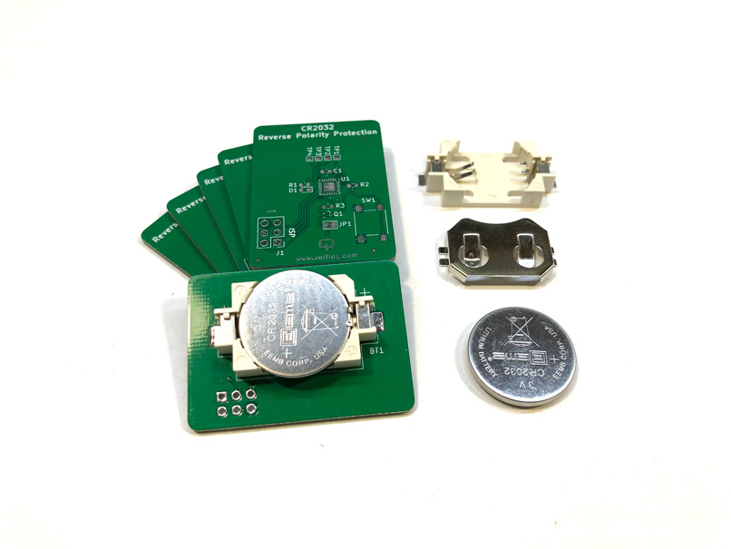

# Reverse Battery Protection Using N-ch Mosfet
I designed this circuit to show a simple circuit to achieve reverse battery protection in low power devices. Everyone knows the classic solution of using an in-line diode but that has one major drawback: the voltage drop on the diode. If your circuit is powered by a CR2032 you can’t afford losing 0.5V on the diode. The circuit I’m showing uses a mosfet to achieve the protection feature but minimises the voltage drop and the losses because a mosfet will have a very low internal resistance when conducting.

More info about this project in [Voltlog #353](https://youtu.be/ag2LE_MbWCE).

